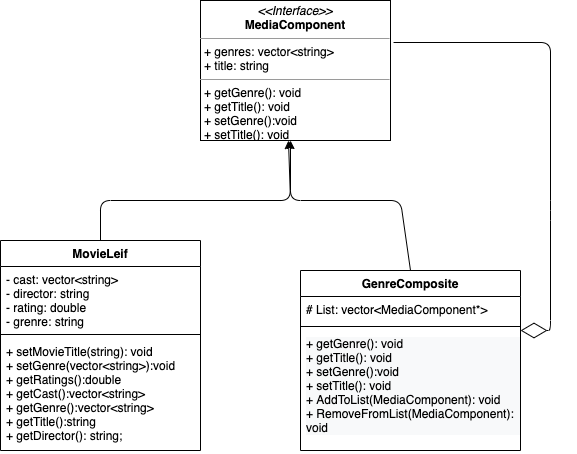

# FAN Spotlight 
 Our final project for CS 100 at UC Riverside. Our group is consisted of three team members and we collaborating together to design a movie library software. 
## Authors: 
 * Frances Isabelle Cristobal(https://github.com/frxncrxs)
 * Alejandra Avitia-Davila(https://github.com/alejandraavitia03)
 * Neda Karemi(https://github.com/nedurland)

## Project Description
  Our goal is to create a movie library/feed manager that allows users to have a feed with recommended movies based off genre and reviews. We will also be incorporating a library system which will allow them to keep track of movies they've watched and want to watch. Our software will allow users to leave ratings and reviews for others to see. We will be using an easy to use GI for our software.
### Why this is our choice:
 The reason we have chosen to create a movie library/feed software is because we are huge fans of films and are currently unsatisfied with different applications available to find movies based on ratings and genre. By creating this software we are hoping to make a much more user friendly and simple experience for ourselves and other movie fanatics who are having trouble picking a movie.
### How we will carry on:
* Language and Tools used:
	* C++ - The language we will be using.
	* Qt  - The Qt framework is cross-platform mostly used for developing desktop applications. Many big named companies use this platform to create their UI, for example: Mercedes Benz.(https://www.qt.io/) 
* Input: 
	Like Pinterest or We Heart It, users will be prompted to give input:
	* Favorite:
		* Movies
		* TV Shows 
	* Personalized
		* Reviews 
		* Ratings
* Output: 
	With the given input we will return the user a customized feed for them and display other users reviews and ratings. 
* Design patterns we will be using:
	* Abstract Factory: This design pattern was picked because it can provide an interface for creating families. We assume this will help with storing data. Unlike visitor pattern being used for individual lists, this is for storing moves already by genres which will be easier to pull. We have an umbrella of movie with different categories. These different category(genres) creations under the same umbrella is where this design pattern will be useful.  

	* Visitor Pattern: This design pattern was picked becuase it allows us to separate the algorithm from our object structure. Also we could possible define a new operations for some classes of an object withought changing the classes. An error we are assuming to encounter is when making the MovieLibrary class there are alot of genres to filter and  that would require a lot of getter functions. With the Visitors I hope to separate the data from the algorithm. We are hoping to offload the algorithm to visitor implementations and add functionality by creating more visitors instead of having to modify and overload the class with the users movie library.    
		

 > ## Phase II
 > In addition to completing the "Class Diagram" section below, you will need to 
 > * Set up your GitHub project board as a Kanban board for the project. It should have columns that map roughly to 
 >   * Backlog, TODO, In progress, In testing, Done
 >   * You can change these or add more if you'd like, but we should be able to identify at least these.
 > * There is no requirement for automation in the project board but feel free to explore those options.
 > * Create an "Epic" (note) for each feature and each design pattern and assign them to the appropriate team member. Place these in the `Backlog` column
 > * Complete your first *sprint planning* meeting to plan out the next 7 days of work.
 >   * Create smaller development tasks as issues and assign them to team members. Place these in the `Backlog` column.
 >   * These cards should represent roughly 7 days worth of development time for your team, taking you until your first meeting with the TA
## Class Diagram

 > Include a class diagram(s) for each design pattern and a description of the diagram(s). Your class diagram(s) should include all the main classes you plan for the project. This should be in sufficient detail that another group could pick up the project this point and successfully complete it. Use proper OMT notation (as discussed in the course slides). You may combine multiple design patterns into one diagram if you'd like, but it needs to be clear which portion of the diagram represents which design pattern (either in the diagram or in the description). 
 
 > ## Phase III
 > You will need to schedule a check-in with the TA (during lab hours or office hours). Your entire team must be present. 
 > * Before the meeting you should perform a sprint plan like you did in Phase II
 > * In the meeting with your TA you will discuss: 
 >   - How effective your last sprint was (each member should talk about what they did)
 >   - Any tasks that did not get completed last sprint, and how you took them into consideration for this sprint
 >   - Any bugs you've identified and created issues for during the sprint. Do you plan on fixing them in the next sprint or are they lower priority?
 >   - What tasks you are planning for this next sprint.

 > ## Final deliverable
 > All group members will give a demo to the TA during lab time. The TA will check the demo and the project GitHub repository and ask a few questions to all the team members. 
 > Before the demo, you should do the following:
 > * Complete the sections below (i.e. Screenshots, Installation/Usage, Testing)
 > * Plan one more sprint (that you will not necessarily complete before the end of the quarter). Your In-progress and In-testing columns should be empty (you are not doing more work currently) but your TODO column should have a full sprint plan in it as you have done before. This should include any known bugs (there should be some) or new features you would like to add. These should appear as issues/cards on your Kanban board. 
 
 ## Screenshots
 > Screenshots of the input/output after running your application
 ## Installation/Usage
 > Instructions on installing and running your application
 ## Testing
 > How was your project tested/validated? If you used CI, you should have a "build passing" badge in this README.
 
